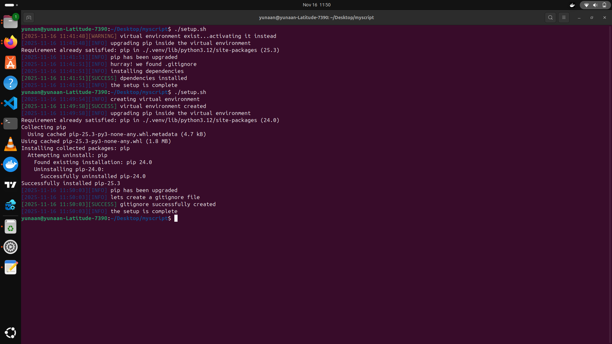

#bash scripting 
these project is a bash script that makes sure new data Engineering team member at Beejan Technology, a company that maintains several Python-based data pipelines and engineering projects.
Each time a new engineer joins, they spend a shorter period of time setting up their development environment, creating virtual environments, upgrading pip, setting up .gitignore files, and installing essential tools.
these helps the whole team save time by over 95% , when the script is executed on the terminal with the command ..../scritp.sh , 

#when executed the script goes on to check for 
  *the existance of a virtual environment (venv) and activating it (creating one if none is available)
  *upgraging pip in our virtual environment to the latest possible one 
  *setting up .gitignore files where theres none 
  *installing the necessary requirement for the project

#example output

#challenges faced
 -learning how to layer my functions to ensure reliability was difficult at first

 #lessons learned 
  -how to break down one difficult problems in little steps to solve a problem
